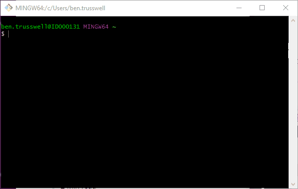

# CRIS-Connect c# .net demo

## Getting Started

**1)** Clone the repository

**2)** You will need a .pfx certificate for the application to run, follow the below steps to generate one:

Firstly, you will need to use OpenSSL- if you do not have it the binaries can be found here- https://wiki.openssl.org/index.php/Binaries

In your terminal navigate to */programdata/hss*

**Generate private key:** *openssl genrsa 2048 > private.pem*

**Generate the self signed certificate:** *openssl req -x509 -days 1000 -new -key private.pem -out public.pem*

**Create PFX:** *openssl pkcs12 -export -in public.pem -inkey private.pem -out crisconnect.pfx*
When prompted for an export password enter: 1234

**3)** Run the executable at *CRIS-Connect\c#\PACSRISIntegrationDemo\PACSRISIntegrationDemo\bin\Debug* 

./CRISConnectDemo.exe

*Gotchas*
=========
If CRIS Reporting is not connecting two common problems are:

1.No or untrusted certificate
-----------------------------
This could manifest itself in CRIS Reporting showing a red banner such as "HSS DTI service unreachable".

Have you generated your own public self certificate as described in the code?
Install openssl package (if you are using Windows, download binaries here).

If not look at [DemoForm.cs](https://github.com/hss-dev/CRIS-Connect/blob/master/c%23/PACSRISIntegrationDemo/PACSRISIntegrationDemo/DemoForm.cs) to see the details of certificate it expects:
* Line 78 - location of certificate file
* Line 87 - to the password of your choice

If you are accessing CRIS Reporting from Chrome then you may need to *accept the certificate authorisation* by browsing to
https://localhost:9998 . This should not happen in electron due to a --ignore-certificate-errors switch, which could be run in chrome.

2.CRIS Reporting has CRIS Connect turned off
--------------------------------------------
A simple postgres query can turn it on again, contact HSS.

