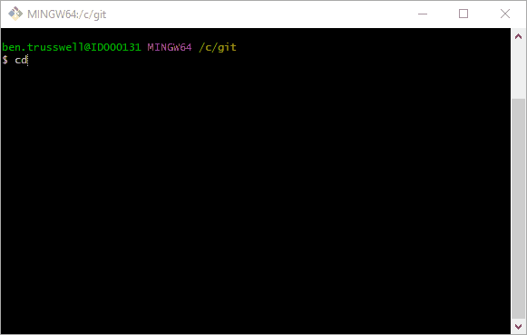
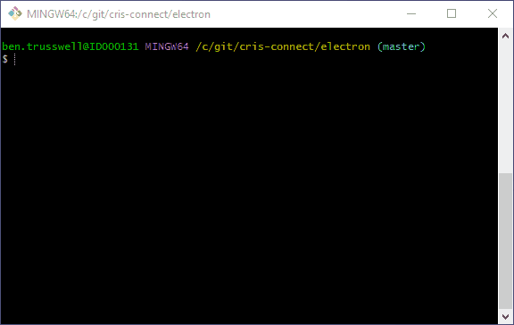
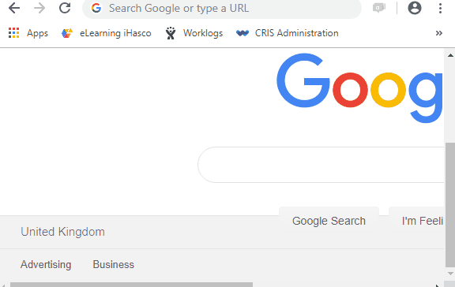

# CRIS-Connect electron demo

## Getting Started

This is a short guide on how to download, install and run CRIS-Connect.

**1)** Clone the repository

**2)** Install the dependencies using NPM

**3)** Start the server using 'npm start'

**4)** If you are accessing CRIS Reporting from Chrome then you may need to accept the certificate authorisation by browsing to https://localhost:9998

